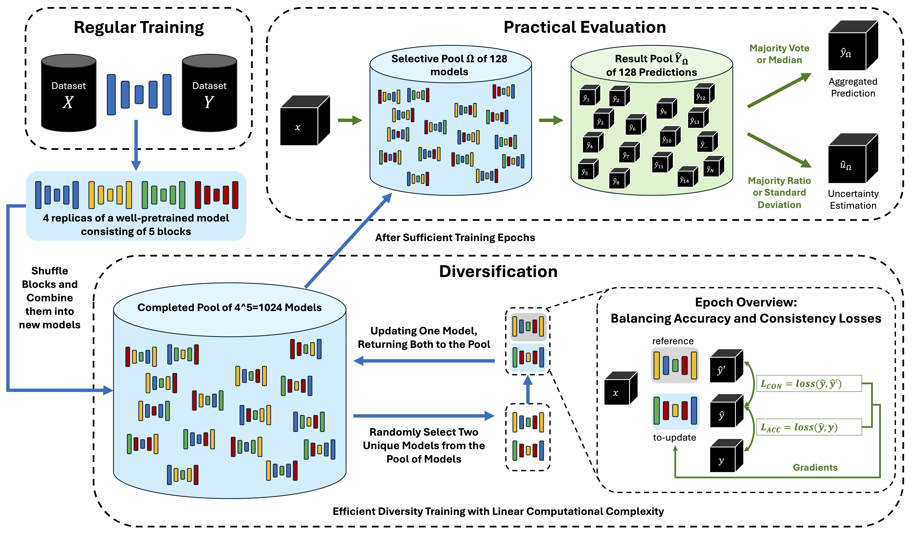

# SASWISE-UE

**Segmentation and Synthesis with Interpretable Scalable Ensembles for Uncertainty Estimation.**

[](https://doi.org/10.1016/j.compbiomed.2025.110258)
[](https://doi.org/10.1016/j.compbiomed.2025.110258)
[](LICENSE)
[](https://www.python.org/downloads/)
[](https://github.com/astral-sh/ruff)



SASWISE-UE is a framework for **uncertainty estimation through
sub-model ensembles** that requires neither modification of the
original model nor any additional training hardware.
A single trained checkpoint is decomposed into independent **blocks**
(logical layer groups), each of which is duplicated into multiple
**variants** (parameter sets). At inference time, a **block
configuration** selects one variant per block to assemble a complete
sub-model. The ensemble of sub-models produces calibrated,
interpretable uncertainty estimates at zero retraining cost.

## Highlights

- Sub-model ensemble exhibits **exponential efficiency** — `V^B`
  candidate sub-models from `B × V` stored variant files
  (e.g. 4096 sub-models from 24 files at `B=6, V=4`).
- Uncertainty maps boost AI **interpretability and reliability**.
- Framework applies universally — tested on CT segmentation and MR ↔
  CT synthesis tasks.
- Strong **correlation between error and uncertainty** under image
  corruption and data undersampling.
- Works **without altering the base model and without extra hardware**.

## Abstract

This work introduces an efficient sub-model ensemble framework aimed at
enhancing the interpretability of medical deep-learning models, thus
increasing their clinical applicability. By generating uncertainty
maps, the framework lets end users evaluate the reliability of model
outputs. We develop a strategy to generate diverse models from a
single well-trained checkpoint, facilitating the training of a model
*family*: multiple outputs are produced from a single input, fused
into a final output, and uncertainty is estimated from the
disagreement between outputs. Implemented on U-Net and UNETR backbones
for segmentation and synthesis tasks, the approach is evaluated on CT
body segmentation and MR-CT synthesis datasets. It achieves a mean
Dice coefficient of **0.814** in segmentation and a Mean Absolute
Error of **88.17 HU** in synthesis (improved from 89.43 HU by
pruning). Robustness is further demonstrated under image corruption
and data undersampling, where the correlation between predicted
uncertainty and downstream error is preserved. The proposed approach
maintains the performance of well-trained models while enhancing
interpretability through effective uncertainty estimation, applicable
to both convolutional and transformer architectures across a range of
imaging tasks.

The companion publication reports state-of-the-art results on two
medical imaging tasks:

| Task | Dataset | Metric | SASWISE-UE |
|---|---|---|---|
| CT body segmentation | TotalSegmentator-style | Dice ↑ | **0.814** |
| MR → CT synthesis | Paired MR / CT | MAE (HU) ↓ | **88.17** (improved from 89.43 by pruning) |

> Chen, W. & McMillan, A. B. *SASWISE-UE: Segmentation and synthesis
> with interpretable scalable ensembles for uncertainty estimation.*
> **Computers in Biology and Medicine**, 2025.
> [doi:10.1016/j.compbiomed.2025.110258](https://doi.org/10.1016/j.compbiomed.2025.110258)

This repository (`wchen-ai/SASWISE`) is the **author's working fork**.
The companion group repository is
[`uw-rad-mitrp/SASWISE-UE`](https://github.com/uw-rad-mitrp/SASWISE-UE).

---

## Table of contents

- [Terminology](#terminology)
- [Core concepts](#core-concepts)
- [Installation](#installation)
- [Adopt any pretrained checkpoint (recommended path)](#adopt-any-pretrained-checkpoint-recommended-path)
  - [Step 0: write a five-callable user module](#step-0-write-a-five-callable-user-module)
  - [Step 1: decompose and materialise variants](#step-1-decompose-and-materialise-variants)
  - [Step 2: fine-tune with adaptive consistency weighting](#step-2-fine-tune-with-adaptive-consistency-weighting)
  - [How `λ` (the consistency weight) is balanced](#how-λ-the-consistency-weight-is-balanced)
  - [Step 3: ensembled inference + uncertainty](#step-3-ensembled-inference--uncertainty)
  - [Python API](#python-api)
- [Quick start (manual hierarchy workflow)](#quick-start-manual-hierarchy-workflow-cifar-10--resnet)
- [End-to-end workflow](#end-to-end-workflow)
- [Repository layout](#repository-layout)
- [Development](#development)
- [Citation](#citation)
- [License](#license)

---

## Terminology

The codebase uses neutral, ML-domain terminology. The published paper
uses a culinary metaphor for the same concepts. The two are mapped
here once and only here:

| Code (this repository)   | Paper / earlier prose | Meaning |
|--------------------------|-----------------------|---------|
| **Block**                | Course                | A logical, non-overlapping partition of the model — typically one or more layers — swapped as a unit. |
| **Variant**              | Serving               | One concrete parameter set for a given block. Multiple variants per block produce ensemble diversity. |
| **Block configuration** (`block_config`) | Menu     | A mapping `{block_id → variant_id}` that selects one variant per block to specify a sub-model. |
| **Sub-model**            | Meal                  | A complete model assembled from one block configuration. |
| **Warehouse**            | Kitchen               | The on-disk store of variants together with the API to read, write, decompose, and assemble them. |
| **`build_warehouse`**    | `kitchen_setup`       | Build a fresh warehouse from a pretrained checkpoint. |
| **`assemble_model`**     | `cook_model`          | Assemble a sub-model on disk from a block configuration. |
| **`BlockWarehouse`**     | `TastingMenu`         | Class that manages the on-disk variant store. |
| **`ModelAssembler`**     | `ModelCook`           | Class that grafts variants into a model instance. |
| **`EnsembleEvaluator`**  | `MichelynInspector`   | CLI that sweeps block configurations and evaluates the ensemble. |

The published paper acronym **SASWISE-UE** is unchanged; only the
internal Python identifiers have been modernised.

## Core concepts

A SASWISE warehouse with `B` blocks and `V` variants per block
exposes `V^B` distinct sub-models from a single trained base
checkpoint, all of which can be evaluated without retraining. With
`B = 6` and `V = 4` that is **4096 sub-models from 24 stored variant
files** (≈6× the size of the base checkpoint on disk).

## Installation

SASWISE requires **Python 3.9+** and PyTorch 1.8 or newer. Three
installation paths are supported.

### From source (recommended for development)

```bash
git clone https://github.com/wchen-ai/SASWISE.git
cd SASWISE
pip install -e ".[dev]"
```

### Pinned `requirements.txt`

```bash
pip install -r requirements.txt
```

### Conda

```bash
conda env create -f environment.yml
conda activate saswise
```

## Adopt any pretrained checkpoint (recommended path)

For users who already have a pretrained model and want to add
uncertainty estimation **without** running the manual
`warehouse_setup` workflow below, the `src.adapters` subpackage
provides a one-command adoption pipeline. The script reads your
checkpoint, decomposes the model into balanced blocks, materialises
perturbed variants on disk, fine-tunes the warehouse with an
auto-balanced diversification consistency loss, and runs ensembled
inference — all without ever holding more than one sub-model in GPU
memory at a time.

### Step 0: write a five-callable user module

The adopter expects a single Python file that defines five top-level
callables. A complete MLP/MNIST example lives at
[`examples/adopt_mnist_mlp.py`](examples/adopt_mnist_mlp.py); the
contract is:

```python
import torch, torch.nn.functional as F
from torch.utils.data import DataLoader

def model_factory() -> torch.nn.Module:
    """Return a fresh, randomly-initialised instance of your architecture."""

def load_base_checkpoint(model: torch.nn.Module, path: str) -> None:
    """Load your pretrained weights into a model_factory() instance."""

def get_dataloaders() -> tuple[DataLoader, DataLoader]:
    """Return (train_loader, val_loader)."""

def infer_fn(model: torch.nn.Module, batch) -> torch.Tensor:
    """One forward pass. `batch` is whatever the dataloader yields."""

def loss_fn(out: torch.Tensor, batch) -> torch.Tensor:
    """Per-batch task loss."""
```

A sixth callable is optional:

```python
def consistency_fn(out_a: torch.Tensor, out_b: torch.Tensor) -> torch.Tensor:
    """Override the default MSE consistency loss with a task-specific one
    (e.g. KL of softmaxes for classification)."""
```

### Step 1: decompose and materialise variants

```bash
python scripts/adopt_checkpoint.py init \
    --user-module   examples/adopt_mnist_mlp.py \
    --checkpoint    pretrained.pt \
    --output-dir    experiment/my_run \
    --decomposition auto-balanced:6 \
    --variants      4
```

This creates `experiment/my_run/warehouse/` with one
`block_<i>/variant_<j>.pt` file per `(block, variant)` pair plus a
`warehouse_metadata.json` describing the block specs. Variant `0` is
always the unperturbed clone of the base, so the warehouse can already
reproduce the original checkpoint as one of its `4⁶ = 4096` sub-models.

`--decomposition` accepts:

- **`auto-balanced:K`** — partition the model into `K` blocks with
  approximately equal parameter counts. Works for any architecture
  and is the default (`K=6`).
- **`auto-top-level`** — every direct child of the root model is its
  own block. Natural for ResNets, U-Nets, and other architectures
  with a small number of named children.

### Step 2: fine-tune with adaptive consistency weighting

```bash
python scripts/adopt_checkpoint.py finetune \
    --user-module   examples/adopt_mnist_mlp.py \
    --warehouse     experiment/my_run/warehouse \
    --epochs        5 \
    --target-ratio  0.1 \
    --warmup-steps  100
```

The fine-tuner runs an *assemble–train–disassemble* loop: each
training step samples two random block configurations, assembles
them into two sub-models, computes
`L_total = L_task + λ · L_consistency`, takes a gradient step, and
persists only the touched variants back to disk. Both sub-models are
deleted from GPU memory at the end of every step. Memory cost is
therefore the size of two sub-models, regardless of how many variants
the warehouse holds.

#### How `λ` (the consistency weight) is balanced

The consistency loss `L_cons` and the task loss `L_task` typically
live on very different scales: cross-entropy on a classification task
might be `~0.5` while the KL between two sub-model outputs starts at
`~0.001`. A naive constant `λ` either lets `L_cons` vanish into the
noise or dominates `L_task` so much that the model never fits the
data. The intuition we want to encode is the one you stated:

> "The accuracy loss is the main part. After that we need the
> consistency loss. We need a mechanism to balance them."

The adopter handles this with **adaptive balancing** by default. It
tracks an exponentially-smoothed magnitude of each loss across
training and recomputes `λ` every step so that, in expectation, the
consistency term contributes a fixed fraction of the total loss
*regardless of absolute scale*:

$$
\lambda \;=\; \frac{r}{1 - r}\;\cdot\;\frac{\mathrm{EMA}[L_\text{task}]}{\mathrm{EMA}[L_\text{cons}]}
\quad\Longrightarrow\quad
\frac{\lambda \cdot L_\text{cons}}{L_\text{task} + \lambda \cdot L_\text{cons}} \;\approx\; r
$$

With the default `target_ratio = 0.1`, the training objective is
roughly **90 % task loss + 10 % consistency loss** at every step,
even as the absolute magnitudes evolve.

A **linear warm-up** (default `warmup_steps = 100`) scales `λ` from
`0` to its adaptive value, so the very first phase of training is
*pure* task loss — the model fits the data first, and only afterwards
does the consistency term begin to pull sub-models toward each other.
That matches the natural intuition above.

`λ` is hard-clipped to `[min_weight, max_weight]` (default
`[0, 100]`) so that a degenerate `L_cons → 0` does not blow up the
formula. If you observe `λ` pegged at `max_weight` for many steps in
a row, increase `--noise-std` during `init` so the variants start
more diverse, or raise `--max-weight` if you want a stronger pull.

To override the defaults:

| Flag | Default | Meaning |
|---|---|---|
| `--consistency-mode adaptive` | (default) | Auto-balance via EMA loss magnitudes. |
| `--target-ratio FLOAT` | `0.1` | Steady-state consistency contribution as a fraction of total loss. |
| `--warmup-steps INT` | `100` | Number of steps over which `λ` ramps linearly from 0. |
| `--ema-decay FLOAT` | `0.9` | Smoothing factor for the loss-magnitude EMAs. Higher = smoother but slower-reacting. |
| `--min-weight FLOAT` | `0.0` | Lower bound on `λ`. |
| `--max-weight FLOAT` | `100.0` | Upper bound on `λ`. Raise if `λ` saturates here. |
| `--consistency-mode fixed --fixed-weight FLOAT` | `--fixed-weight 0.1` | Constant `λ`, no auto-balancing. Warm-up still applies. |

### Step 3: ensembled inference + uncertainty

```bash
python scripts/adopt_checkpoint.py infer \
    --user-module        examples/adopt_mnist_mlp.py \
    --warehouse          experiment/my_run/warehouse \
    --num-configurations 64 \
    --task               classification \
    --output             predictions.pt
```

The inference script samples up to `--num-configurations` distinct
block configurations (or enumerates them all if the total is small),
assembles each as a fresh sub-model on the GPU, runs the user's
`infer_fn` over the validation loader, and folds the per-sample
outputs into a running mean and second moment via **Welford's
algorithm**. The full per-configuration outputs are *never* stored —
memory cost is `O(output_size)` regardless of how many sub-models
you sample.

The output `.pt` file contains a dict with:

| Key | Shape | Description |
|---|---|---|
| `mean` | `(N, ...)` | Per-sample ensemble mean prediction. |
| `std`  | `(N, ...)` | Per-element standard deviation across configurations. |
| `predictive_entropy` | `(N,)` | Entropy of `softmax(mean)` (classification only). |
| `num_configurations` | scalar | How many sub-models were evaluated. |
| `block_configurations` | `list[dict]` | The configurations actually sampled. |

> **Important — for classification, use `predictive_entropy`, not `std`.**
> The per-element `std` of the *raw logits* across configurations is
> not a meaningful uncertainty signal for classification tasks: in our
> MNIST demo (see [`examples/SAMPLE_OUTPUT.md`](examples/SAMPLE_OUTPUT.md))
> the AUROC of misclassification given `std` was **0.44** (worse than
> random), while the AUROC given `predictive_entropy` was **0.92**.
> The right uncertainty scalar for classification is the entropy of
> the softmaxed mean prediction. `std` is the right metric for
> regression and segmentation, where outputs are continuous and
> per-element variance is interpretable.

### Python API

The CLI is a thin wrapper over a Python API that you can also call
directly from a notebook or training script:

```python
from src.adapters import (
    ConsistencyBalance,
    DiskWarehouse,
    decompose_balanced,
    finetune_warehouse,
    infer_with_uncertainty,
    initialize_variants,
)
import my_user_module  # your 5-callable file imported normally

# 1. Decompose + materialise.
model = my_user_module.model_factory()
my_user_module.load_base_checkpoint(model, "pretrained.pt")
specs = decompose_balanced(model, num_blocks=6)
warehouse = DiskWarehouse("experiment/my_run/warehouse", specs, num_variants=4)
initialize_variants(model, specs, num_variants=4, warehouse=warehouse)

# 2. Fine-tune with adaptive consistency weighting.
finetune_warehouse(
    warehouse=warehouse,
    user_module=my_user_module,
    epochs=5,
    consistency=ConsistencyBalance(target_ratio=0.1, warmup_steps=100),
)

# 3. Ensembled inference + uncertainty.
pred = infer_with_uncertainty(
    warehouse=warehouse,
    user_module=my_user_module,
    num_configurations=64,
    task="classification",
)
print(pred.mean.shape, pred.std.shape, pred.predictive_entropy.shape)
```

### Run the calibration demo

The repository ships with an end-to-end demo that exercises the full
pipeline on either MNIST or a synthetic Gaussian mixture and reports
the calibration story directly:

```bash
# Tries MNIST; falls back to synthetic if download is unavailable.
python examples/demo_uncertainty_classification.py

# Force the synthetic dataset (no download, ~30 seconds).
python examples/demo_uncertainty_classification.py --dataset synthetic

# Force MNIST (~3 minutes on CPU including the first-time download).
python examples/demo_uncertainty_classification.py --dataset mnist
```

The demo prints the per-step `λ` schedule, ensemble accuracy, mean
predictive entropy split by correct vs incorrect predictions, the
Pearson correlation between entropy and 0/1 error, the AUROC of
misclassification given entropy, and a five-row risk–coverage table
showing the error rate at coverage levels 100% / 80% / 60% / 40% / 20%.

A full sample run on MNIST (with a one-epoch base, one-epoch fine-tune,
9 sub-models) is recorded verbatim at
[`examples/SAMPLE_OUTPUT.md`](examples/SAMPLE_OUTPUT.md). Headline:
**ensemble accuracy 93.4 %, AUROC of misclassification given entropy
0.92, error rate drops from 6.6 % at 100 % coverage to 0 % at 20 %
coverage.**

---

## Quick start (manual hierarchy workflow, CIFAR-10 / ResNet)

If you want full manual control over the block decomposition — for
example to assign specific layer groups to specific blocks — the
repository ships with an end-to-end CIFAR-10 + ResNet-50 example
that exercises every stage of the framework.

```bash
# 1. Bootstrap the experiment folder, download CIFAR-10, save a base
#    ResNet-50 checkpoint to experiment/CIFAR10_ResNet/.
python tests/test_CIFAR10_ResNet.py

# 2. Decompose the base checkpoint into a block hierarchy.
python -m src.models.warehouse_setup.generate_hierarchy \
    --state_dict experiment/CIFAR10_ResNet/models/base_model.pth \
    --out experiment/CIFAR10_ResNet/models/hierarchy

# 3. Annotate the hierarchy file by hand (add block indices in [ ]),
#    then analyse it.
python -m src.models.warehouse_setup.block_analysis \
    --model_hierarchy <hierarchy file from step 2> \
    --out experiment/CIFAR10_ResNet/models/block_analysis

# 4. Materialise per-block variant directories.
python -m src.models.warehouse_setup.create_variant \
    --block_analysis <analysis file from step 3> \
    --out experiment/CIFAR10_ResNet \
    --state_dict experiment/CIFAR10_ResNet/models/base_model.pth

# 5. Train the variants with the diversification consistency loss.
python src/models/train_diversification.py \
    --config experiment/train_configs/cifar10_resnet_diversification.yaml

# 6. Sweep block configurations and evaluate the ensemble.
python src/models/ensemble_evaluator.py --config-spec 10
```

`--config-spec` accepts:
- a positive integer (e.g. `10`) — sample that many random configurations,
- a percentage (e.g. `10%`) — that fraction of all possible configurations,
- the literal `full` — exhaustively evaluate every configuration.

## End-to-end workflow

Setting up a brand-new experiment follows the same five stages as the
quick-start above, just with your own dataset and model.

1. **Pick a base checkpoint** — any PyTorch state dict will do.
2. **Generate the hierarchy** — `warehouse_setup.generate_hierarchy`
   prints a tree-shaped text file with `[ ]` slots for block indices.
3. **Annotate the hierarchy** — assign each layer (or layer group) a
   block index. Empty brackets inherit the parent's block.
4. **Analyse and create variants** — `warehouse_setup.block_analysis`
   summarises the annotated hierarchy; `warehouse_setup.create_variant`
   materialises per-block variant directories.
5. **Train with diversification** — `train_diversification.py` trains
   each variant with a per-batch consistency loss against a randomly
   chosen sibling sub-model.
6. **Inspect the ensemble** — `ensemble_evaluator.py` reconstructs and
   evaluates a sweep of block configurations to produce uncertainty
   estimates.

A new experiment can be bootstrapped from the templates in
`experiment/templates/`:

```bash
mkdir -p experiment/MY_EXPERIMENT/{models,logs,variants,data}
cp experiment/templates/train_config.yaml experiment/MY_EXPERIMENT/
cp experiment/templates/variants/variant_info.json experiment/MY_EXPERIMENT/variants/
```

Then update the paths and hyperparameters in the copied files.

## Repository layout

```
SASWISE/
├── pyproject.toml             # Build + lint + test config (PEP 621)
├── setup.py                   # Backwards-compatible shim
├── requirements.txt           # Runtime deps (pinned ranges)
├── requirements-dev.txt       # Dev / lint / test deps
├── environment.yml            # Conda environment
├── CITATION.cff               # GitHub "Cite this repository" metadata
├── LICENSE                    # MIT
├── README.md                  # This file
├── config.yaml                # Top-level fine-tuning config template
├── main.py                    # Fine-tuning entry point
├── experiment/
│   ├── templates/             # Templates for new experiments
│   │   ├── variants/variant_info.json
│   │   └── train_config.yaml
│   └── train_configs/
│       └── cifar10_resnet_diversification.yaml
├── scripts/
│   └── adopt_checkpoint.py     # Adopter CLI: init / finetune / infer
├── examples/
│   └── adopt_mnist_mlp.py      # Reference 5-callable user module
├── src/
│   ├── adapters/                       # Adopter package (model-agnostic)
│   │   ├── decompose.py                # auto-balanced / top-level / manual
│   │   ├── disk_warehouse.py           # On-disk variant store
│   │   ├── variant_init.py             # Clone-and-perturb variant init
│   │   ├── assembly.py                 # assemble_submodel(factory, cfg, wh)
│   │   ├── finetune.py                 # Adaptive consistency-balanced loop
│   │   └── uncertainty.py              # Welford-streaming ensemble inference
│   ├── data/
│   │   ├── cifar10_dataset.py
│   │   └── monai_cifar10_dataset.py
│   ├── models/                         # Manual / hierarchy-driven workflow
│   │   ├── warehouse_core.py           # Hierarchy + block analysis
│   │   ├── warehouse_setup/            # CLI sub-package
│   │   │   ├── generate_hierarchy.py
│   │   │   ├── block_analysis/
│   │   │   ├── create_variant/
│   │   │   ├── hierarchy/
│   │   │   └── variant/
│   │   ├── block_warehouse.py          # Variant registry
│   │   ├── model_assembly.py           # Combine variants into a model
│   │   ├── model_assembler.py          # Alternative assembling API
│   │   ├── model_loader.py             # Pretrained loaders
│   │   ├── read_warehouse_info.py
│   │   ├── train_diversification.py    # Training script
│   │   ├── train_mnist.py              # MNIST reference run
│   │   ├── ensemble_evaluator.py       # Block-configuration sweep + eval
│   │   ├── build_warehouse_cli.py
│   │   └── cifar10_resnet.py
│   ├── training/
│   │   └── fine_tuner.py
│   └── utils/
│       ├── helpers.py
│       ├── logger.py
│       └── training_logger.py
└── tests/
    ├── test_CIFAR10_ResNet.py
    ├── test_warehouse_setup.py
    └── test_block_warehouse.py
```

## Development

```bash
# Install the dev extras (ruff, pytest, pre-commit, mypy).
pip install -e ".[dev]"

# Enable pre-commit hooks (run on every git commit).
pre-commit install

# Lint + auto-fix.
ruff check --fix .
ruff format .

# Run the test suite.
pytest

# Type-check (loose by default; tighten per-module in pyproject.toml).
mypy src
```

## Citation

If SASWISE is useful in your research, please cite the paper:

```bibtex
@article{chen2025saswise,
  title   = {SASWISE-UE: Segmentation and synthesis with interpretable
             scalable ensembles for uncertainty estimation},
  author  = {Chen, Weijie and McMillan, Alan B.},
  journal = {Computers in Biology and Medicine},
  year    = {2025},
  doi     = {10.1016/j.compbiomed.2025.110258},
  url     = {https://doi.org/10.1016/j.compbiomed.2025.110258}
}
```

GitHub will also render a "Cite this repository" button populated from
[`CITATION.cff`](CITATION.cff).

## License

This project is released under the [MIT License](LICENSE).
Copyright © 2025 Weijie Chen.
